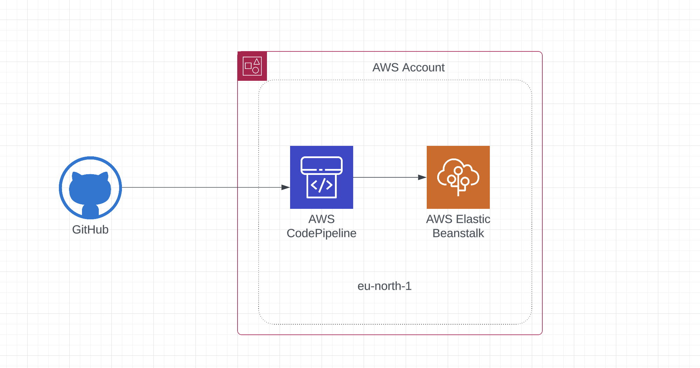

# AWS CI/CD Pipeline with CodePipeline and Elastic Beanstalk

## Architecture
The pipeline automates deployments from GitHub to AWS Elastic Beanstalk using AWS CodePipeline.

### Components:
1. **GitHub** – Stores source code and triggers deployments.
2. **AWS CodePipeline** – Automates build, test, and deployment.
3. **AWS Elastic Beanstalk** – Manages hosting, scaling, and provisioning.

## Deployment Workflow
1. Push code to **GitHub**.
2. **AWS CodePipeline** detects changes and deploys.
3. **Elastic Beanstalk** handles hosting and scaling.

## Setup Guide
1. Create an Elastic Beanstalk environment.
2. Set up CodePipeline with GitHub as source and Elastic Beanstalk as deployment provider.

## Infrastructure

